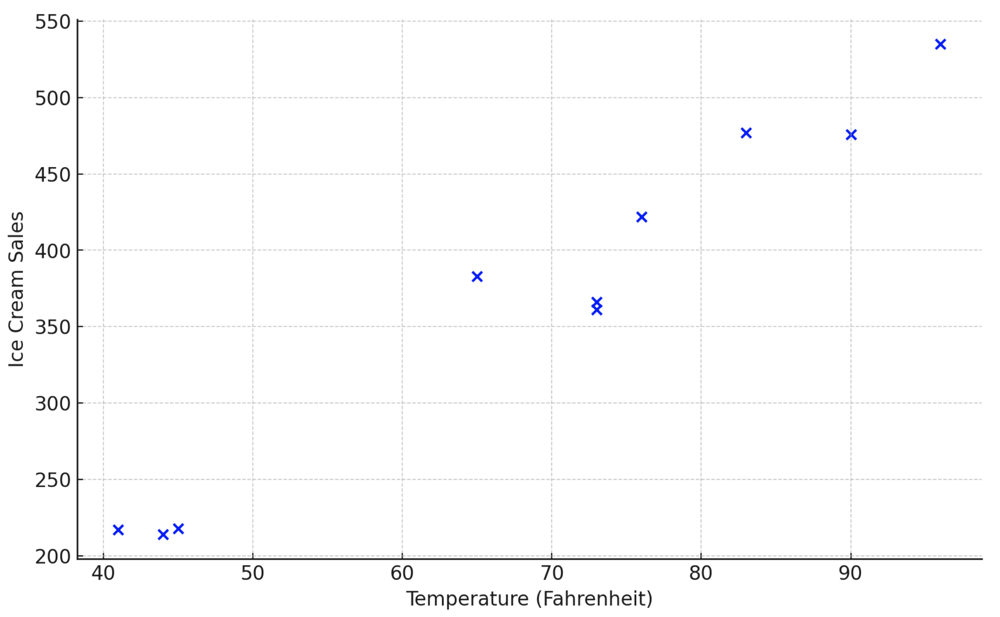
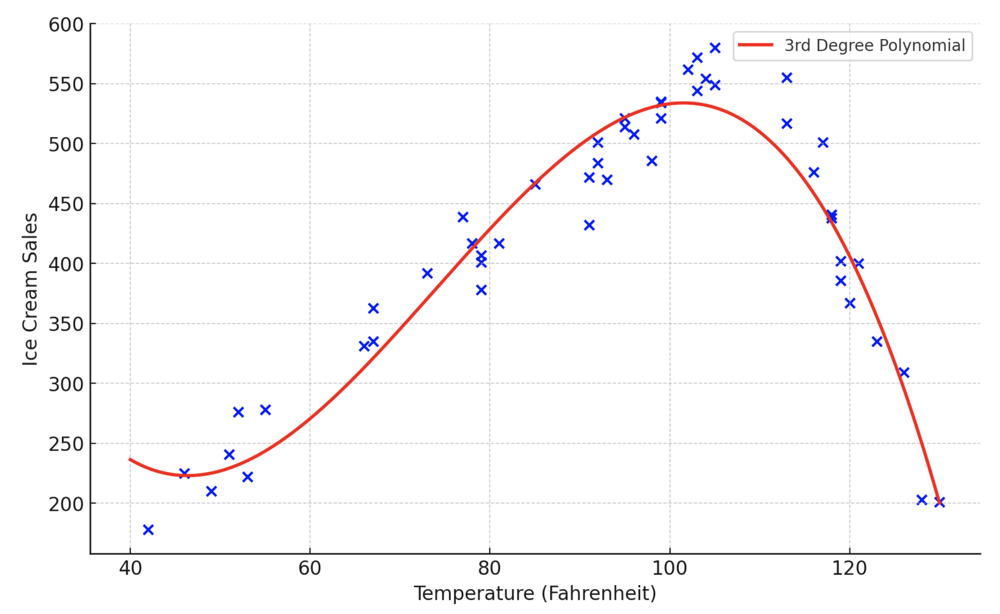

# Artificial Intelligence

> "Writing is thinking. To write well is to think clearly. That's why it's so hard."
>
> David McCullough

## Overview

One of the objectives of this lesson is to provide future developers, managers, and leaders with a foundational understanding of artificial intelligence (AI), one of the most transformative technologies of our time.

For the last two decades, the kind of technology ["eating the world"](https://a16z.com/why-software-is-eating-the-world/) was internet-based, CRUD apps like Instagram and Airbnb. So we set out to learn how to build that kind of software.

However, AI and machine learning (ML) are now emerging as the next wave of impactful technologies. This shift allows developers to build applications leveraging powerful AI models, such as those powering platforms like [ChatGPT](https://chatgpt.com/).

## AI for Developers

You don't need to be an ML expert to start using AI in your projects. Building your own intuition and mental model of how AI systems work can help you make your own AI-driven software. The purpose of this lesson is to give you some intuition, so that you can start applying this new technology to your own projects.

A great resource to dive deeper is the [Fast.ai course](https://course.fast.ai/), which teaches practical ML and AI development.

## OpenAI and Accessibility

OpenAI has made some of the most advanced AI models available to developers through APIs. Available at [OpenAI](https://platform.openai.com/signup), these APIs let developers integrate powerful AI features into their applications. They also created their own consumer-facing product called ChatGPT. ChatGPT was supposed to mainly be an advertisement for their API, but has become the fastest growing consumer tech product of all time.

## Hands-on with OpenAI Playground

The OpenAI Playground is a wonderful, visual explorer that OpenAI built to help developers understand the capabilities of the API.

To experiment in the OpenAI playground:
1. Sign up for a developer account and purchase at least $5 of credits: [OpenAI Signup](https://platform.openai.com/signup).
2. Visit the [Playground](https://platform.openai.com/playground/complete). Ensure you are on the "Completions" tab and the "Model" dropdown is set to **davinci-002**.


### Experimenting with Prompts

- Try entering the prompt: `The best thing about AI is its ability to`
- In the maximum length field on the right side, select 1.
- Submit the prompt to see the AI's completion.
- The model will return a bit of additional text — one "token". This text is called the "output" or "completion".
- Keep Submitting to make the sentence grow.


#### Temperature

- Trying starting over with the original input.
- Adjust the **"Temperature"** setting to observe how randomness affects the output:
- Notice that it doesn't generate the same thing every time — there is some randomness to it.
- Try adjusting the Temperature value on the right side to 0.
- Submit, and then Regenerate. Regenerate a few times.
- Now it does generate the same thing (nearly) every time.
- Try increasing the temperature to the max.
- Do you notice how the results change with temperature?
  - Low temperature (e.g., 0) generates consistent responses.
  - High temperature increases variability in the responses.


A temperature of around 0.8 seems to give the "best" results. Why? No one knows. This is more like biology than the computer science we're used to; rather than designing all capabilities up front and then painstakingly codifying them by hand, we develop a model and then poke at it to discover its emergent properties.

#### Context
Try generating some text based on the following prompts:
- "Ruby"
- "Ruby is a"
- "Ruby is a programming"

We can see that the further we steer the prompt down a path, the results are more specific/deterministic. This is called providing "context". This led to the rise of "prompt engineering". Through experimentation, people realized that giving the GPT the first part of a conversation and then letting it write the next message led to good results. This, eventually, led to ChatGPT.

You're probably asking, where do the probabilities come from? How can GPT predict which word is most likely to follow an arbitrary chunk of text?

Let's delve into some theory for a bit. Prepare yourself for some math.


## How AI Models Work

### What is a "Model"

There are many common definitions:
- A person who wears and displays clothing — a fashion model.
- An example or standard — a role model.
- A prototype, design, or variant — the model of a car or phone.
- A simplified representation of a thing — a scale model of a building.

In science and statistics, a "model" is a mathematical formula that you can plug inputs into, and it transforms them into an output. The outputs are predictions that the model is making about the world — "if x happens, then y will happen".

### Example: Ice cream stand
Imagine we run an ice cream stand. We want to predict how much ice cream to purchase in advance, to maximize sales but minimize waste. How can we make the best possible prediction?

One approach would be to diligently log temperature versus sales for some period of time:

| Temperature (F) | Sales |
| --------------- | ----- |
| 73              | 361   |
| 83              | 477   |
| 76              | 422   |
| 73              | 366   |
| 65              | 383   |

Then we could make a plot of our data:


It's not too useful yet. But let's keep diligently collecting observations:



And eventually, a pattern starts to emerge:


Let's say that next week the forecast is 50 degrees. I want to predict how much ice cream will be consumed, so I can buy the right amount. I could just sorta eyeball it, but to make more systematic predictions...

I could draw a line that approximates the data:


Recall that we can describe a line with an equation of the form:

`y = mx + b`

Where `m` is the slope of the line and `b` is where the line crosses the y axis (intercept). You can play around with [this interactive visualization](https://www.desmos.com/calculator/p5tqihi9fq) to see how changing `m` and `b` affect the line.

This line that I drew:


Is described by:

`y = 7x − 140`

Where y is ice cream sales and x is degrees Fahrenheit. This formula is a *model* of the ice cream/temperature phenomenon. Once I've determined the m and b that describe the line I drew through my data, I can plug in any temperature for x and predict how many ice cream sales. `x` and the constant factor `1` are the **parameters** in this model (2 of them). `m` (7 in this case) and `b` (-140 in this case) are called the **weights** in this model.

But, someone else might eyeball the line differently:


Is there a way to decide, objectively, which line is a better model?

One approach is to measure the "error" of each prediction vs the data:


If we add up all the errors, we can come up with a measure of "fit" (or lack of fit, to be precise). Another common approach is to square the errors before adding them up. This approach gives extreme outliers more influence over fit. [Let's play around with this interactive visualization.](https://www.geogebra.org/m/XUkhCJRj) Try checking the first three checkboxes and then playing around with the sliders for `m` and `b` until you find the best possible line. Then you can see how close you got to the "ideal" line by checking the last box.

This is a method called "least squares". The way I found the best fit line was:
1. Move the intercept a little; then play around with the slope until the sum of squares started going up; then reverse direction until the sum of squares slowed down and stopped.
2. Then I'd rinse and repeat by moving the intercept, play around with the slope, and see if I could beat my previous score.
3. I iteratively arrived at the best line by observing the rate of change of the fit as I nudged each parameter.

In this approach, the sum of the squares is called the **loss function** — it represents how far away from the data the model is. We played around by trial and error until we minimized the loss. If we run the least squares method for the ice cream stand data, we get:

`y = 6x + 60`


It's somewhere between the two eyeballed lines:


So for we've:
- collected some data — input/output pairs.
- generalized a model (above) into which we can plug any input to predict a corresponding output.

What does our model predict our sales will be when the temperature is 0 degrees? How about -20 degrees?

#### Hallucinations

Predictions made outside of the range of the training data are basically useless — or worse, deceptive. In the new world of generative AI, these are referred to as "hallucinations".

So we should keep collecting more data if we want to make predictions across a wider range of inputs.


Our old model isn't a very good fit anymore:


And "hallucinates" at 125 degrees:


We could run least squares on the new, larger dataset, but a line is no longer a very good fit:


We might need a new architecture for our model. [Let's try a parabola](https://www.desmos.com/calculator/3ltwect0mc):


Better. But [a third degree polynomial can be made to fit even better](https://www.desmos.com/calculator/wqufjhhj8y):



This model is something like:

```latex
y = -0.001x^3 + x^2 - 52x + 1200
```

The additional terms of the third-degree polynomial — the new architecture — gave us more flexibility to fit the data. The search for the right parameters (-0.001, 1, -52, and 1200) got a lot harder.

Linear regression is a 200 year old form of "machine learning". "Machine learning" is where we try to develop a solution by collecting data and **inferring** a pattern, rather than deducing the fundamental theory underlying the phenomenon.

### Example: Newton's Second Law

`p = mv`

`p` is momentum, `m` is mass, and `v` is velocity. If we know the mass and velocity of an object, this model allows us to predict its momentum (by multiplying them together). This is Newton's Second Law. He didn't use regression; he developed a theory of how the underlying mechanism worked and deduced it. By contrast, our formula for the temperature/ice cream relationship was inferred. (data-driven)

### Takeaways from this exercise:

1. More data improves the model: We improve the fit of the model through trial and error — by measuring loss, adjusting weights, measuring again, etc, etc, until we get close to a minimum.
The more times we iterate, the closer we get to the "true" minimum.


2. The predictions of the model are only useful within the range of the data it was trained on: Outside, it "hallucinates". More parameters give us more flexibility to fit the data. More parameters without more data can lead to "overfitting". More data and more parameters increase the difficulty of iterating to minimize loss.

3. We don't know what the meaning of the parameters is, just that they work: When someone "releases a model", that means releasing both the architecture and the weights.
To fully open source it, you would release the method you used to get there — the training data, the loss function you chose, etc.


### Neural Networks

Linear regression only works well for input/output data that is numerical. More generalized machine learning techniques have been developed that work for other types of data — for example, images, sound clips, and text. (eg 1957: Frank Rosenblatt's Perceptron, roughly modeled on a neuron.)

[What Is a Neural Network?](https://playground.tensorflow.org/#activation=tanh&batchSize=10&dataset=spiral&regDataset=reg-plane&learningRate=0.03&regularizationRate=0&noise=0&networkShape=4,2,2&seed=0.16614&showTestData=false&discretize=false&percTrainData=50&x=true&y=true&xTimesY=true&xSquared=true&ySquared=true&cosX=false&sinX=true&cosY=false&sinY=true&collectStats=false&problem=classification&initZero=false&hideText=false)

> "It’s a technique for building a computer program that learns from data. It is based very loosely on how we think the human brain works. First, a collection of software 'neurons' are created and connected together, allowing them to send messages to each other. Next, the network is asked to solve a problem, which it attempts to do over and over, each time strengthening the connections that lead to success and diminishing those that lead to failure."

Theoretically, neural networks can learn any function, unlike linear regression.

## Quiz

- What is a primary benefit of OpenAI making their models accessible to developers?
- Encourages wider adoption and innovation by regular developers.
  - Correct! OpenAI democratized AI development by providing accessible tools.
- Allows only tech giants to dominate the AI landscape.
  - Not quite. OpenAI's approach reduces monopolization in AI development.
- Ensures complete control of AI applications by OpenAI.
  - Incorrect. OpenAI focuses on empowering developers.
{: .choose_best #openai_access title="OpenAI Accessibility" points="1" answer="1" }

- Which statement about temperature settings in AI models is true?
- Lower temperatures always generate incorrect outputs.
  - Not quite. Lower temperatures generate more deterministic responses.
- Temperature settings have no impact on AI behavior.
  - Incorrect. Temperature significantly influences output variability.
- Higher temperatures create more diverse outputs.
  - Correct! High temperatures increase randomness in the output.
{: .choose_best #temperature_effect title="Temperature in AI Models" points="1" answer="3" }

- What does the equation `y = mx + b` represent in AI modeling?
- The formula for predicting outcomes in a linear regression model.
  - Correct! This equation describes the relationship between inputs and outputs in linear regression.
- A general formula for all types of machine learning models.
  - Not quite. This equation is specific to linear regression.
- The training process for a neural network.
  - Incorrect. Neural networks use a different process.
{: .choose_best #linear_regression title="Linear Regression Equation" points="1" answer="1" }

- Why is it important to limit predictions to the range of training data?
- Models always perform better with extreme data values.
  - Not quite. Extreme values can lead to poor or incorrect predictions.
- Predictions outside the training range may be inaccurate or misleading.
  - Correct! This limitation is due to a lack of data to guide the model.
- To reduce computation time during prediction.
  - Incorrect. Limiting the range isn't related to computation time.
{: .choose_best #training_range title="Limits of Training Data Range" points="1" answer="2" }

- What happens when a model is overfitted?
- It performs consistently well on all datasets.
  - Not quite. Overfitting impacts performance on unseen data.
- It becomes more accurate for predictions outside its training range.
  - Incorrect. Overfitting does not improve performance on new or extreme inputs.
- It memorizes training data but struggles with new data.
  - Correct! Overfitting reduces the model's ability to generalize.
{: .choose_best #overfitting title="Understanding Overfitting" points="1" answer="3" }

## Conclusion

Artificial intelligence represents a transformative leap in how software interacts with and learns from the world. This lesson introduced foundational concepts of AI, its practical applications, and how developers can start leveraging tools like OpenAI's APIs. With a basic intuition of how AI models work, you are equipped to experiment, innovate, and integrate these powerful technologies into your projects.

## Resources
- [Artificial Intelligence Readings](https://learn.firstdraft.com/lessons/329-ai-readings)
- [Example OpenAI API request](https://learn.firstdraft.com/lessons/121-openai-api-example)
- [OpenAi Developer Playground](https://platform.openai.com/playground/complete)

---

## Time Taken
- Approximately how long (in minutes) did this lesson take you to complete?
{: .free_text_number #time_taken title="Time taken" points="1" answer="any" }


